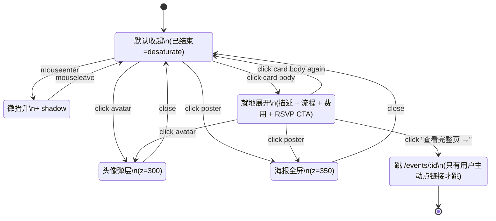

# cyc.center 活动卡片交互系统（统一设计）

> 这份文档是活动卡片**跨界面信息呈现 + 交互一致性**的最终依据。任何"小卡片状态/展开/报名/编辑/海报 lightbox"的设计冲突时以本文档为准。
>
> 来源：玖玖（产品负责人）2026-05-02 提出的设计统一诉求 —— "近期活动 / 主页 / 全部活动 这几个清单页都不统一信息呈现，要统一设计"。

---

## 为什么写这一份

当前 cyc.center 上"活动卡片"这个组件以**至少 3 种实现**散落在不同页面：

| 出现地点 | 实现 | 数据形状 | 交互 |
|---|---|---|---|
| `/` 首页 | `home-act-card`（CSR，[index.html](index.html)）| 部分 fields | 整卡 click 跳详情 |
| `/events` 列表 | `el-card`（SSR，[api/events-list.js](api/events-list.js)）| 部分 fields | 整卡 click 跳详情 |
| `/events/:id` 详情 | 整页 `event-*` block（SSR，[api/event-page.js](api/event-page.js)）| 完整 fields | 多种按钮 |
| `/community/:id` 参与历史 | 文字列表（无卡片）| 仅标题+日期 | 文字 click 跳详情 |

**问题**：
1. 同一份"活动"数据，三个地方**各自渲染**，加字段要改三次
2. **交互不一致**：海报点不开、报名按钮只在详情页有、编辑入口只在详情页类型 chip 边上、头像 stack（3.1.2 刚加）只在 home + list 有
3. **状态信息混乱**："对外开放" pill 在 home 卡硬编码、在 list 卡没有、在详情页是真字段（其实当前还没建字段）

**目标**：定义**一套**信息呈现 + 一套交互模型，统一所有 surface。

---

## 一、四个 surface 的角色

```
┌──────────────────────────────────────────────────────────┐
│  surface=home      简版卡，密度高，吸引力强（首页流）        │
│  surface=list      标准卡，信息全，可比较（/events 列表）   │
│  surface=mini      微卡，仅标题+日期+状态（profile 列出）   │
│  surface=detail    详情页（活动自身就是一张大卡片）          │
└──────────────────────────────────────────────────────────┘
```

四个 surface 共用**同一份数据 + 同一套交互**，差异仅在**密度** / **信息字段开关** / **布局**。

---

## 二、信息矩阵（哪个 surface 显示什么）

✅ 默认显示 · ⚙️ 可选 · ❌ 不显示 · ➕ 仅展开后显示

| 字段 | home<br>(收) | home<br>(展) | list<br>(收) | list<br>(展) | mini | detail |
|---|:-:|:-:|:-:|:-:|:-:|:-:|
| 海报缩略图 | ✅ 16:10 | ✅ 16:10 | ✅ 16:10 | ✅ 16:10 | ❌ | ✅ 大图 hero |
| 标题 | ✅ | ✅ | ✅ | ✅ | ✅ | ✅ |
| 日期 | ✅ pill | ✅ pill | ✅ day-head | ✅ day-head | ✅ inline | ✅ hero |
| 时间 | ✅ pill | ✅ pill | ✅ inline | ✅ inline | ❌ | ✅ inline |
| 地点 | ✅ inline | ✅ inline | ✅ inline | ✅ inline | ❌ | ✅ inline |
| 活动状态 pill | ✅ | ✅ | ✅ | ✅ | ❌ | ✅ |
| 开放性 pill | ✅ | ✅ | ✅ | ✅ | ❌ | ✅ |
| 类型 chips | ⚙️ | ➕ | ✅ | ✅ | ❌ | ✅ |
| **嘉宾头像 stack** | ✅ | ✅ | ✅ | ✅ | ❌ | ❌ |
| **报名头像 stack** | ✅ | ✅ | ✅ | ✅ | ❌ | ❌ |
| **描述全文** | ❌ | ➕ | ❌ | ➕ | ❌ | ✅ |
| **流程** | ❌ | ➕ | ❌ | ➕ | ❌ | ✅ |
| **费用** | ❌ | ➕ | ❌ | ➕ | ❌ | ✅ |
| **报名方式** | ❌ | ➕ | ❌ | ➕ | ❌ | ✅ |
| **「📝 详情/报名 →」CTA** | ❌ | ➕ | ❌ | ➕ | ❌ | (RSVP 按钮) |
| 完整 speakers section | ❌ | ❌ | ❌ | ❌ | ❌ | ✅ |
| 完整 RSVP attendees | ❌ | ❌ | ❌ | ❌ | ❌ | ✅ |
| 编辑入口（admin）| ❌ | ❌ | ❌ | ❌ | ❌ | ✅ |

---

## 三、六个交互原语（一致性核心）

每张卡片都遵循相同的交互规则，无论 surface。

### 1️⃣ 整卡 click → **就地展开**（toggle `is-expanded` class）

> **设计变更（2026-05-02 玖玖反馈）**：原方案是"整卡 click → 跳详情页"，被否决。新方案是 click 切换展开/收起，扩展信息（描述 / 流程 / 费用 / 报名 CTA）原地呈现，少跳页 → casual browsing 更顺。

- 行为：toggle 当前卡片的 `.is-expanded` class，扩展区平滑展开
- **例外** —— 这些点击不触发展开：
  - 内部 button（avatar / RSVP / × 删除）：自身 onclick 已 `event.stopPropagation()`
  - 内部 anchor（如"查看完整页 →"）：onclick `event.stopPropagation()`
  - Cmd/Ctrl/中键 click 卡片本身 → 浏览器默认（新 tab 打开 `/events/:id`，保留 SEO + 分享）
- **取舍**：桌面端 grid 上一张展开会把同行其他卡片往下挤（密度损失）—— 接受，因为 casual browsing 价值高于 scan 密度
- 埋点：`event_card_click`

### ➡️ 「查看完整页 →」link（展开区底部）→ 跳 `/events/:record_id`

- 用途：share URL / 浏览器收藏 / SEO escape
- 行为：anchor 默认 navigate
- 注意：必须 `event.stopPropagation()`，避免触发卡片折叠

### 2️⃣ 头像 click → person modal（不离页）

- 已落地 ✅（Phase 3.1.2）
- 移动端底部 sheet，桌面居中
- modal 内含：avatar + name + bio + "查看完整 profile →" 链 `/community/:id`
- 埋点：`event_card_avatar_click`

### 3️⃣ 海报 click → poster lightbox（不离页）

- **新增**（当前点击海报无反应）
- 行为：在原位 fade in 全屏黑底 lightbox，居中显示原图（不是缩略图）
- 关闭：背景 click + ESC + 右上角 ×
- 移动端：双指 pinch zoom 原生支持（图片用 `` 不是 `<div>` background）
- 4 个 surface 都生效（home / list / mini=不显示海报所以无 / detail）
- 埋点：`event_card_poster_click`（待加 KNOWN_EVENTS）

### 4️⃣ "我要参加" button click → RSVP modal（不离页）

- **当前只在详情页有**，未来要保留只在详情页（不在卡片小卡上加）
- 已落地：`#rsvpModal` overlay，bottom sheet on mobile
- **统一规则**：所有需要"输入 + 提交"的 modal 用同一组件 `<rsvp-modal>` pattern（class `rsvp-modal-overlay` + `rsvp-modal`）—— 已经统一了
- 埋点：`rsvp_click`（已有）

### 5️⃣ "编辑" button click → 跳生成器编辑模式

- **新增**（当前活动详情页只能"编辑类型 chip"，整张活动改不了）
- 入口：详情页右上角"⋯"菜单 → "编辑活动"（admin 密码门后才显示）
- 行为：跳 `/generator?edit=<record_id>`，generator 加载活动数据预填表单，提交按 PUT 而非 POST
- 不在 home / list / mini 卡片上显示编辑入口（避免误触 + UI 噪音）
- 埋点：`event_edit_click`（待加 KNOWN_EVENTS）

### 不能做的（红线）

- ❌ 长按 / 右键菜单 —— 移动端体验不一致，能放进 ⋯ 菜单的不要藏
- ❌ 卡内多个**主**入口 —— 一张卡只一个主交互（展开），其他都是辅助按钮（avatar/海报/RSVP）
- ❌ 同时展开多张时给"折叠所有"按钮 —— 让用户自己控制，不要 nanny 行为

---

## 四、卡片状态机



**5 个状态**，每个 surface 都遵守同一套。

---

## 五、Modal 层级 / z-index map

```
z=200  rsvp-modal-overlay         （仅详情页：报名 / 编辑类型 / 删除报名）
z=300  person-modal-overlay       （所有 surface：头像点击）
z=350  poster-lightbox-overlay    （所有 surface：海报点击）
z=400  admin-confirm-modal        （仅 admin：删除活动等不可逆操作）
```

**单 modal 政策**：同时只有一个 overlay 处于 `.open`。打开新 modal 时若已有 modal 打开 → 先关旧的。这避免堆叠 + 焦点丢失。

**移动端/桌面统一行为**：所有 overlay 都遵守
- mobile (`<640px`)：底部 sheet `align-items: flex-end`，`border-radius: 24px 24px 0 0`
- desktop (`≥640px`)：居中 `align-items: center`，`border-radius: 24px`

已经在 [styles/11-avatars-modal.css](styles/11-avatars-modal.css) 的 `.person-modal-overlay` 落地了这个 pattern，poster lightbox 沿用。

---

## 六、新增字段：「对外开放」

当前所有未过期活动卡都硬编码"🌿 对外开放"pill —— **错的**。有的活动只对成员，不应对外宣传。

### 数据
- 飞书「活动通告」表加单选字段「**是否对外开放**」（值：`对外开放` / `仅成员`，默认 `对外开放`）
- 解析在 [api/_activity.js](api/_activity.js) `parseRecord` 加 `act.is_public = getSelect(f['是否对外开放']) !== '仅成员'`

### 渲染
- `act.is_public === true` → `🌿 对外开放` pill（绿/沙金）
- `act.is_public === false` → `🔒 仅成员` pill（灰）
- 已结束 → 不显示开放性 pill（无意义）

### 录入
- generator (`/generator/index.html`) 表单加 toggle：☐ 对外开放（默认勾选）

---

## 七、组件契约

### 函数签名

```js
renderActivityCard(activity, options) → HTMLString
```

`activity` 来自 `parseRecord(rawFeishuRecord)`，shape 为 `_activity.js` 已定义的 `act` 对象 + 3.1.2 加的 `card_speakers/card_attendees/card_attendee_total`。

`options`：
```js
{
  surface:      'home' | 'list' | 'mini' | 'detail',
  isAdmin:      boolean,    // 是否显示编辑入口（仅 detail surface 生效）
  showAvatars:  boolean,    // 默认根据 surface 决定
  showTypes:    boolean,    // 默认 home=false / list=true / mini=false
}
```

### 实现位置

由于 cyc-tools 是 zero-build，不能写 ES module 共享给 SSR + CSR。妥协方案：

- **服务端**：[api/_card.js](api/_card.js)（新建）export `renderActivityCard(act, opts)` —— event-page.js / events-list.js 共用
- **客户端**：[cyc-card.js](cyc-card.js)（新建，根目录）一个全局 `<script>`，window-level `renderActivityCard` 函数，与服务端**字符串等价**（人工维护对齐，加快照测试防漂移）—— index.html 共用

> 接受的代价：服务端/客户端两份"复制品"。换来：所有 surface 共享 1 套数据形状 + 1 套交互。改一处 = 改两处（少于现在的 4 处），可控。

### 快照测试（防漂移）

新建 `tests/card-snapshot.test.js`：
- mock 一个 fixture activity 对象
- 调服务端 `renderActivityCard` + 在 jsdom 里调客户端版
- assert 两个 HTML 字符串相等（normalize whitespace）

→ 任何一边改动忘了同步 → CI 红。

---

## 八、迁移路线（按"风险 × 价值"排）

| Phase | 工作 | 影响面 | 估时 |
|---|---|---|---|
| **3.1.2.1** | Avatar 同步 bug 修：`api/avatar-upload.js` 上传后回写飞书成员表「照片」字段 + invalidate | 1 文件 | 30 分钟 |
| **3.1.2.2** | 「对外开放」字段：飞书加字段 + `_activity.js` 解析 + 卡片按字段渲染 + generator 表单加 toggle | 4 文件 | 1 小时 |
| **3.1.2.3** | 主页活动流：当前未来 4 周 → 未来 4 周 + 最近 2 周历史（已结束 desaturate）| 1 文件 | 15 分钟 |
| **3.5.1** | 抽 `api/_card.js` 服务端组件 + `cyc-card.js` 客户端镜像 + 快照测试 | 5 文件 + 1 测试 | 半天 |
| **3.5.2** | Poster lightbox 组件（独立 overlay，所有 surface 共用） | 2 文件（lightbox.css + cyc-card.js 内嵌 JS）| 1.5 小时 |
| **3.5.3** | 详情页"⋯ 编辑活动"入口 + generator 加 `?edit=<id>` 模式（载入预填 + PUT 而非 POST）| 3 文件 | 半天 |
| **3.5.4** | 旧实现下线：`renderCard` in index.html / `renderCard` in events-list.js / event-page.js 整页 → 全部改用新组件 | 3 文件 | 1 小时 |
| **3.5.5** | 加 `event_card_poster_click` / `event_edit_click` 到 `_events.js` `KNOWN_EVENTS` + 更新 `tests/events-known.test.js` | 2 文件 | 10 分钟 |

总计约 1.5-2 天可以把"统一卡片系统"完成。

---

## 九、设计原则速记

- **One card, many surfaces** —— 一份组件，4 种密度
- **Click = expand, except buttons** —— 整卡 click 就地展开；button / 内嵌 link 各司其职
- **Person uses modal, activity uses expand** —— peek 一个**人** 用 modal（轻、不破坏布局）；peek 一个**活动**用就地展开（信息量大、连续浏览友好）
- **Detail page = canonical URL** —— 展开是 UI 便利，详情页是 source of truth（SEO + share + bookmark）
- **Single modal at a time** —— 不堆叠，焦点不丢
- **Mobile sheet, desktop center** —— 所有 overlay 一致
- **No hidden gestures** —— 长按/右键的事，进 ⋯ 菜单
- **Data shape stable** —— 卡片字段加减只动 `_activity.js` parser 一处

---

## 十、跟现有文档的关系

- **不覆盖** [homepage-design](homepage-design.md) —— 那份是**首页结构**的依据，本份是**卡片组件**的依据，互补
- **不覆盖** [DESIGN.md](DESIGN.md) —— 那份定义视觉 token / 三层架构，本份用其 token 不另立系统
- **覆盖**（即将）：当前散落在 index.html / events-list.js 里的两份 `renderCard` 实现，等 Phase 3.5.1 抽完组件就废弃

---

## 十一、变更日志

- **2026-05-02** 玖玖反馈"信息呈现不统一 + 交互不统一"—— 创建本文档
- **2026-05-02 (v2)** 玖玖反馈"卡片应该就地展开" —— 翻转原则：原 v1 红线"❌ 卡片就地展开"删除，整卡 click 改为 toggle is-expanded；保留详情页作为 SEO/share canonical URL；展开区底部加「📝 详情/报名 →」link 作 escape hatch
