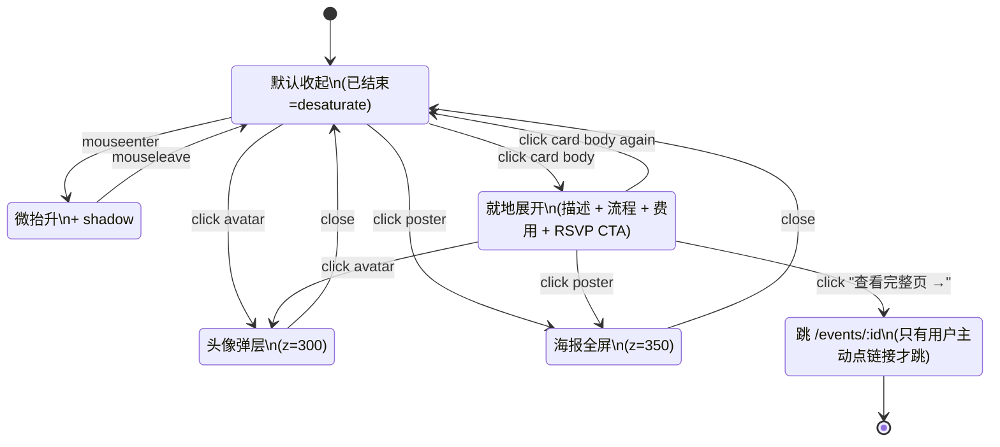

# cyc.center 活动卡片交互系统（统一设计）

> 这份文档是活动卡片**跨界面信息呈现 + 交互一致性**的最终依据。任何"小卡片状态/展开/报名/编辑/海报 lightbox"的设计冲突时以本文档为准。
>
> 来源：玖玖（产品负责人）2026-05-02 提出的设计统一诉求 —— "近期活动 / 主页 / 全部活动 这几个清单页都不统一信息呈现，要统一设计"。
>
> ---
>
> ## ⚠️ v3 更新（2026-05-09）—— 5/8-5/9 拓展期演化已落地
>
> 本文档原 v1/v2 是"统一卡片"的**设想 + 设计原则**（5/2 写）。5/8-5/9 之间该统一**已大部分实施**，并在玖玖 7 轮反馈中演化出 v1/v2 没料到的形态：
>
> - ✅ **Phase B 通用卡迁移**（commits `b3d0c9e` `aab4cd8`）—— `/events` 列表 + `/shanghai` 都迁到通用 `home-act-card`，原"4 surface 各自实现"压缩到 **3 surface 共用 1 component**（home / events list / shanghai 都是同一个 `home-act-card`，仅 detail 仍独立）
> - ✅ **home-act-card 列式布局**（v4.2.6 → v4.2.10，5 轮反馈稳定）—— 不再是简版收起式，而是 datestack+thumb header / RSVP+attendees CTA 行的列式
> - ✅ **双城分流**（commits `2efe89d` `0017444`）—— `/events` 加大理 / 上海 segmented tab，每 tab 独立卡流
> - ✅ **双语 toggle**（commits `9ac377f` `d558b23` `07181fc`）—— 卡片元素全 zh/en，title_en / location_en / desc_en 等并行字段；topbar lang sync 跨页保持
> - ✅ **筹备中状态视觉**（commits `07181fc` `9ac377f` `d560d45`）—— 占位标题加横线划掉 + 筹备 pill+提示同行 + 不显示具体时间地点
>
> 详见下方新增 §十二「2026-05 拓展期演化」。
>
> 原 v1/v2 内容（§一 ~ §十一）保留作历史叙事，**冲突以 §十二 为准**。

---

## 为什么写这一份

当前 cyc.center 上"活动卡片"这个组件以**至少 3 种实现**散落在不同页面：

| 出现地点 | 实现 | 数据形状 | 交互 |
|---|---|---|---|
| `/` 首页 | `home-act-card`（CSR，[index.html](index.html)）| 部分 fields | 整卡 click 跳详情 |
| `/events` 列表 | `el-card`（SSR，[api/events-list.js](api/events-list.js)）| 部分 fields | 整卡 click 跳详情 |
| `/events/:id` 详情 | 整页 `event-*` block（SSR，[api/event-page.js](api/event-page.js)）| 完整 fields | 多种按钮 |
| `/community/:id` 参与历史 | 文字列表（无卡片）| 仅标题+日期 | 文字 click 跳详情 |

**问题**：
1. 同一份"活动"数据，三个地方**各自渲染**，加字段要改三次
2. **交互不一致**：海报点不开、报名按钮只在详情页有、编辑入口只在详情页类型 chip 边上、头像 stack（3.1.2 刚加）只在 home + list 有
3. **状态信息混乱**："对外开放" pill 在 home 卡硬编码、在 list 卡没有、在详情页是真字段（其实当前还没建字段）

**目标**：定义**一套**信息呈现 + 一套交互模型，统一所有 surface。

---

## 一、四个 surface 的角色

```
┌──────────────────────────────────────────────────────────┐
│  surface=home      简版卡，密度高，吸引力强（首页流）        │
│  surface=list      标准卡，信息全，可比较（/events 列表）   │
│  surface=mini      微卡，仅标题+日期+状态（profile 列出）   │
│  surface=detail    详情页（活动自身就是一张大卡片）          │
└──────────────────────────────────────────────────────────┘
```

四个 surface 共用**同一份数据 + 同一套交互**，差异仅在**密度** / **信息字段开关** / **布局**。

---

## 二、信息矩阵（哪个 surface 显示什么）

✅ 默认显示 · ⚙️ 可选 · ❌ 不显示 · ➕ 仅展开后显示

| 字段 | home<br>(收) | home<br>(展) | list<br>(收) | list<br>(展) | mini | detail |
|---|:-:|:-:|:-:|:-:|:-:|:-:|
| 海报缩略图 | ✅ 16:10 | ✅ 16:10 | ✅ 16:10 | ✅ 16:10 | ❌ | ✅ 大图 hero |
| 标题 | ✅ | ✅ | ✅ | ✅ | ✅ | ✅ |
| 日期 | ✅ pill | ✅ pill | ✅ day-head | ✅ day-head | ✅ inline | ✅ hero |
| 时间 | ✅ pill | ✅ pill | ✅ inline | ✅ inline | ❌ | ✅ inline |
| 地点 | ✅ inline | ✅ inline | ✅ inline | ✅ inline | ❌ | ✅ inline |
| 活动状态 pill | ✅ | ✅ | ✅ | ✅ | ❌ | ✅ |
| 开放性 pill | ✅ | ✅ | ✅ | ✅ | ❌ | ✅ |
| 类型 chips | ⚙️ | ➕ | ✅ | ✅ | ❌ | ✅ |
| **嘉宾头像 stack** | ✅ | ✅ | ✅ | ✅ | ❌ | ❌ |
| **报名头像 stack** | ✅ | ✅ | ✅ | ✅ | ❌ | ❌ |
| **描述全文** | ❌ | ➕ | ❌ | ➕ | ❌ | ✅ |
| **流程** | ❌ | ➕ | ❌ | ➕ | ❌ | ✅ |
| **费用** | ❌ | ➕ | ❌ | ➕ | ❌ | ✅ |
| **报名方式** | ❌ | ➕ | ❌ | ➕ | ❌ | ✅ |
| **「📝 详情/报名 →」CTA** | ❌ | ➕ | ❌ | ➕ | ❌ | (RSVP 按钮) |
| 完整 speakers section | ❌ | ❌ | ❌ | ❌ | ❌ | ✅ |
| 完整 RSVP attendees | ❌ | ❌ | ❌ | ❌ | ❌ | ✅ |
| 编辑入口（admin）| ❌ | ❌ | ❌ | ❌ | ❌ | ✅ |

---

## 三、六个交互原语（一致性核心）

每张卡片都遵循相同的交互规则，无论 surface。

### 1️⃣ 整卡 click → **就地展开**（toggle `is-expanded` class）

> **设计变更（2026-05-02 玖玖反馈）**：原方案是"整卡 click → 跳详情页"，被否决。新方案是 click 切换展开/收起，扩展信息（描述 / 流程 / 费用 / 报名 CTA）原地呈现，少跳页 → casual browsing 更顺。

- 行为：toggle 当前卡片的 `.is-expanded` class，扩展区平滑展开
- **例外** —— 这些点击不触发展开：
  - 内部 button（avatar / RSVP / × 删除）：自身 onclick 已 `event.stopPropagation()`
  - 内部 anchor（如"查看完整页 →"）：onclick `event.stopPropagation()`
  - Cmd/Ctrl/中键 click 卡片本身 → 浏览器默认（新 tab 打开 `/events/:id`，保留 SEO + 分享）
- **取舍**：桌面端 grid 上一张展开会把同行其他卡片往下挤（密度损失）—— 接受，因为 casual browsing 价值高于 scan 密度
- 埋点：`event_card_click`

### ➡️ 「查看完整页 →」link（展开区底部）→ 跳 `/events/:record_id`

- 用途：share URL / 浏览器收藏 / SEO escape
- 行为：anchor 默认 navigate
- 注意：必须 `event.stopPropagation()`，避免触发卡片折叠

### 2️⃣ 头像 click → person modal（不离页）

- 已落地 ✅（Phase 3.1.2）
- 移动端底部 sheet，桌面居中
- modal 内含：avatar + name + bio + "查看完整 profile →" 链 `/community/:id`
- 埋点：`event_card_avatar_click`

### 3️⃣ 海报 click → poster lightbox（不离页）

- **新增**（当前点击海报无反应）
- 行为：在原位 fade in 全屏黑底 lightbox，居中显示原图（不是缩略图）
- 关闭：背景 click + ESC + 右上角 ×
- 移动端：双指 pinch zoom 原生支持（图片用 `` 不是 `<div>` background）
- 4 个 surface 都生效（home / list / mini=不显示海报所以无 / detail）
- 埋点：`event_card_poster_click`（待加 KNOWN_EVENTS）

### 4️⃣ "我要参加" button click → RSVP modal（不离页）

- **当前只在详情页有**，未来要保留只在详情页（不在卡片小卡上加）
- 已落地：`#rsvpModal` overlay，bottom sheet on mobile
- **统一规则**：所有需要"输入 + 提交"的 modal 用同一组件 `<rsvp-modal>` pattern（class `rsvp-modal-overlay` + `rsvp-modal`）—— 已经统一了
- 埋点：`rsvp_click`（已有）

### 5️⃣ "编辑" button click → 跳生成器编辑模式

- **新增**（当前活动详情页只能"编辑类型 chip"，整张活动改不了）
- 入口：详情页右上角"⋯"菜单 → "编辑活动"（admin 密码门后才显示）
- 行为：跳 `/generator?edit=<record_id>`，generator 加载活动数据预填表单，提交按 PUT 而非 POST
- 不在 home / list / mini 卡片上显示编辑入口（避免误触 + UI 噪音）
- 埋点：`event_edit_click`（待加 KNOWN_EVENTS）

### 不能做的（红线）

- ❌ 长按 / 右键菜单 —— 移动端体验不一致，能放进 ⋯ 菜单的不要藏
- ❌ 卡内多个**主**入口 —— 一张卡只一个主交互（展开），其他都是辅助按钮（avatar/海报/RSVP）
- ❌ 同时展开多张时给"折叠所有"按钮 —— 让用户自己控制，不要 nanny 行为

---

## 四、卡片状态机



**5 个状态**，每个 surface 都遵守同一套。

---

## 五、Modal 层级 / z-index map

```
z=200  rsvp-modal-overlay         （仅详情页：报名 / 编辑类型 / 删除报名）
z=300  person-modal-overlay       （所有 surface：头像点击）
z=350  poster-lightbox-overlay    （所有 surface：海报点击）
z=400  admin-confirm-modal        （仅 admin：删除活动等不可逆操作）
```

**单 modal 政策**：同时只有一个 overlay 处于 `.open`。打开新 modal 时若已有 modal 打开 → 先关旧的。这避免堆叠 + 焦点丢失。

**移动端/桌面统一行为**：所有 overlay 都遵守
- mobile (`<640px`)：底部 sheet `align-items: flex-end`，`border-radius: 24px 24px 0 0`
- desktop (`≥640px`)：居中 `align-items: center`，`border-radius: 24px`

已经在 [styles/11-avatars-modal.css](styles/11-avatars-modal.css) 的 `.person-modal-overlay` 落地了这个 pattern，poster lightbox 沿用。

---

## 六、新增字段：「对外开放」

当前所有未过期活动卡都硬编码"🌿 对外开放"pill —— **错的**。有的活动只对成员，不应对外宣传。

### 数据
- 飞书「活动通告」表加单选字段「**是否对外开放**」（值：`对外开放` / `仅成员`，默认 `对外开放`）
- 解析在 [api/_activity.js](api/_activity.js) `parseRecord` 加 `act.is_public = getSelect(f['是否对外开放']) !== '仅成员'`

### 渲染
- `act.is_public === true` → `🌿 对外开放` pill（绿/沙金）
- `act.is_public === false` → `🔒 仅成员` pill（灰）
- 已结束 → 不显示开放性 pill（无意义）

### 录入
- generator (`/generator/index.html`) 表单加 toggle：☐ 对外开放（默认勾选）

---

## 七、组件契约

### 函数签名

```js
renderActivityCard(activity, options) → HTMLString
```

`activity` 来自 `parseRecord(rawFeishuRecord)`，shape 为 `_activity.js` 已定义的 `act` 对象 + 3.1.2 加的 `card_speakers/card_attendees/card_attendee_total`。

`options`：
```js
{
  surface:      'home' | 'list' | 'mini' | 'detail',
  isAdmin:      boolean,    // 是否显示编辑入口（仅 detail surface 生效）
  showAvatars:  boolean,    // 默认根据 surface 决定
  showTypes:    boolean,    // 默认 home=false / list=true / mini=false
}
```

### 实现位置

由于 cyc-tools 是 zero-build，不能写 ES module 共享给 SSR + CSR。妥协方案：

- **服务端**：[api/_card.js](api/_card.js)（新建）export `renderActivityCard(act, opts)` —— event-page.js / events-list.js 共用
- **客户端**：[cyc-card.js](cyc-card.js)（新建，根目录）一个全局 `<script>`，window-level `renderActivityCard` 函数，与服务端**字符串等价**（人工维护对齐，加快照测试防漂移）—— index.html 共用

> 接受的代价：服务端/客户端两份"复制品"。换来：所有 surface 共享 1 套数据形状 + 1 套交互。改一处 = 改两处（少于现在的 4 处），可控。

### 快照测试（防漂移）

新建 `tests/card-snapshot.test.js`：
- mock 一个 fixture activity 对象
- 调服务端 `renderActivityCard` + 在 jsdom 里调客户端版
- assert 两个 HTML 字符串相等（normalize whitespace）

→ 任何一边改动忘了同步 → CI 红。

---

## 八、迁移路线（按"风险 × 价值"排）

| Phase | 工作 | 影响面 | 估时 |
|---|---|---|---|
| **3.1.2.1** | Avatar 同步 bug 修：`api/avatar-upload.js` 上传后回写飞书成员表「照片」字段 + invalidate | 1 文件 | 30 分钟 |
| **3.1.2.2** | 「对外开放」字段：飞书加字段 + `_activity.js` 解析 + 卡片按字段渲染 + generator 表单加 toggle | 4 文件 | 1 小时 |
| **3.1.2.3** | 主页活动流：当前未来 4 周 → 未来 4 周 + 最近 2 周历史（已结束 desaturate）| 1 文件 | 15 分钟 |
| **3.5.1** | 抽 `api/_card.js` 服务端组件 + `cyc-card.js` 客户端镜像 + 快照测试 | 5 文件 + 1 测试 | 半天 |
| **3.5.2** | Poster lightbox 组件（独立 overlay，所有 surface 共用） | 2 文件（lightbox.css + cyc-card.js 内嵌 JS）| 1.5 小时 |
| **3.5.3** | 详情页"⋯ 编辑活动"入口 + generator 加 `?edit=<id>` 模式（载入预填 + PUT 而非 POST）| 3 文件 | 半天 |
| **3.5.4** | 旧实现下线：`renderCard` in index.html / `renderCard` in events-list.js / event-page.js 整页 → 全部改用新组件 | 3 文件 | 1 小时 |
| **3.5.5** | 加 `event_card_poster_click` / `event_edit_click` 到 `_events.js` `KNOWN_EVENTS` + 更新 `tests/events-known.test.js` | 2 文件 | 10 分钟 |

总计约 1.5-2 天可以把"统一卡片系统"完成。

---

## 九、设计原则速记

- **One card, many surfaces** —— 一份组件，4 种密度
- **Click = expand, except buttons** —— 整卡 click 就地展开；button / 内嵌 link 各司其职
- **Person uses modal, activity uses expand** —— peek 一个**人** 用 modal（轻、不破坏布局）；peek 一个**活动**用就地展开（信息量大、连续浏览友好）
- **Detail page = canonical URL** —— 展开是 UI 便利，详情页是 source of truth（SEO + share + bookmark）
- **Single modal at a time** —— 不堆叠，焦点不丢
- **Mobile sheet, desktop center** —— 所有 overlay 一致
- **No hidden gestures** —— 长按/右键的事，进 ⋯ 菜单
- **Data shape stable** —— 卡片字段加减只动 `_activity.js` parser 一处

---

## 十、跟现有文档的关系

- **不覆盖** [homepage-design](homepage-design.md) —— 那份是**首页结构**的依据，本份是**卡片组件**的依据，互补
- **不覆盖** [DESIGN.md](DESIGN.md) —— 那份定义视觉 token / 三层架构，本份用其 token 不另立系统
- **覆盖**（即将）：当前散落在 index.html / events-list.js 里的两份 `renderCard` 实现，等 Phase 3.5.1 抽完组件就废弃

---

## 十一、变更日志

- **2026-05-02** 玖玖反馈"信息呈现不统一 + 交互不统一"—— 创建本文档
- **2026-05-02 (v2)** 玖玖反馈"卡片应该就地展开" —— 翻转原则：原 v1 红线"❌ 卡片就地展开"删除，整卡 click 改为 toggle is-expanded；保留详情页作为 SEO/share canonical URL；展开区底部加「📝 详情/报名 →」link 作 escape hatch
- **2026-05-09 (v3)** 5/8-5/9 拓展期演化回填 —— 详见 §十二。Phase B 通用卡迁移已 ship（home / events list / shanghai 三 surface 共用 `home-act-card`，原计划 §八 3.5.1-3.5.4 部分已落地）。新增双城 / 双语 / 筹备状态 3 个未在 v1/v2 框架内的维度

---

## 十二、2026-05 拓展期演化（v3）

> **本节是当前权威**。原 §一 ~ §十 是 v1/v2 设想，本节是真实 ship 后的状态。冲突以本节为准。

### 12.1 surface 收敛 4 → 2

| Surface | 5/2 v1 设想 | 5/9 实际 |
|---|---|---|
| home | `home-act-card`（CSR）| ✅ `home-act-card`（CSR，列式布局 v4.2.10）|
| list（/events）| `el-card`（SSR） | ✅ **迁到 `home-act-card`** —— commit `b3d0c9e`（Phase B commit 1）|
| shanghai（/shanghai）| ❌ 不存在 | ✅ `home-act-card`（迁移 commit `aab4cd8`，Phase B commit 3）|
| mini（profile 列出）| 文字列表（无卡片）| ⏳ 仍未做卡片化，仍是文字列表 |
| detail（/events/:id）| 整页 `event-*` block | ✅ 不变，仍独立（一张大卡片即整页）|

**净效果**：原计划"3 个清单 surface 共用 1 component"已落地（home / list / shanghai），剩 mini / detail 仍独立。这是 v1 §八 迁移路线 3.5.1-3.5.4 的**部分实施**（不是抽 `_card.js`，而是直接让 `/events` SSR 和 `/shanghai` CSR 都渲染同款 `home-act-card` markup）。

### 12.2 home-act-card 列式布局（v4.2.6 → v4.2.10）

5/2 v2 没规定 home-act-card 的内部结构。v4.2.6 起在玖玖 7 轮反馈下定型为**列式 header + content + cta 行**：

```
┌─────────────────────────────────────────┐
│ [datestack ┃ thumb 16:10]               │  ← header 行
│  日 · 月       (海报或时段渐变占位)         │
├─────────────────────────────────────────┤
│ 标题（zh）                                │
│ Title (en，italic 灰)                     │  ← 双语并列
│ ⏰ 19:00 · 📍 苍山下咖啡桌                │  ← meta 行
├─────────────────────────────────────────┤
│ 状态 pill · 类型 chips                    │
│ ─────────────────────────────────────  │
│ [RSVP 按钮]      [报名头像 stack +N]      │  ← CTA 行（v4.2.7 加）
└─────────────────────────────────────────┘
```

**反馈轮次**（每轮一个 commit）：
1. v4.2.6 (`3f24041`)：扁平化（去 inner padding 嵌套）+ 层次升级（向 /shanghai 学习）
2. v4.2.7 (`f9c67b3`)：列式布局确立（datestack+thumb header / RSVP+attendees CTA 行）
3. v4.2.8 (`d4a9aaa`)：mobile 截断 / 字体层次 / 展开去重
4. v4.2.9 (`d558b23`)：紧凑卡片 / 头像 / topbar lang / hero 透 / CTA 文案
5. v4.2.10 (`07181fc`)：3 区块间距 / glass CTA / lang sync / 筹备中特殊卡

**关键决策**：
- header 用 `datestack`（日大、月小）+ thumb 16:10 并列，不是单纯的"poster on top, text below"
- 海报缺失时 thumb 走 `cyc-time-*` 5 段时段渐变占位（DESIGN.md Pattern 10）
- 双语标题 zh/en 并列（en italic 灰），不是 toggle 切换 —— 见 12.4
- CTA 行 (RSVP + attendees) 是 v4.2.7 才加的，原 v2 §三 红线"❌ 卡内多个**主**入口"被部分突破：现在卡内有 2 个主交互（展开 + RSVP），可接受因为 RSVP 是 critical conversion path

### 12.3 双城分流（commits `2efe89d` `0017444`）

`/events` 顶部加 segmented tab：

```
[ 大理 (默认) ] [ 上海 ]
```

- 数据源：飞书活动表加 `city` 字段（值：`大理` / `上海`）
- 渲染：tab 切换瞬时（不刷页），用 `?city=大理` / `?city=上海` URL param 持久化
- 筛选：服务端 SSR 时按 `city` 过滤；CSR tab 切换时拉对应数据
- 展示：tab 状态用 `cyc-stamp` 字号 + green underline；不用渐变 / 不用 brand color

**新 surface**：`/shanghai` 是 city=上海 的独立着陆页（hero "706 × muShanghai · 当下在发生什么" + 卡流），不是 tab 的一种 view，是独立路由。两者关系：
- `/shanghai` = 落地页 + 上海全活动卡流 + RSVP form（双语）
- `/events?city=上海` = 全站 events 列表里看上海的 view

详见 [[706 x muShanghai 行动计划]] (vault `cyc.center/04 执行/04`)。

### 12.4 双语 toggle（commits `9ac377f` `d558b23` `07181fc`）

不是切换 toggle（一次只显示一种语言），而是**zh/en 并列字段并行渲染**：

| 飞书字段 | zh 字段 | en 字段 |
|---|---|---|
| 标题 | 标题 | title_en |
| 地点 | 地点 | location_en |
| 描述 | 活动/项目描述 | desc_en |
| 时间 | 时间 (中文格式 "5月12日 19:00")| 同字段，模板自动 fallback "May 12 · 19:00" |

**渲染规则**：
- topbar lang toggle：zh / en 二选一，全站持久化（localStorage `cyc-lang`）
- lang=zh 时：标题 zh 主、en 在下方 italic 灰
- lang=en 时：标题 en 主、zh 在下方 muted
- en 字段缺失时：双向 fallback 显示 zh
- topbar lang state 跨页 sync（`d558b23`），刷新不丢

**不在范围内**：
- ❌ 全站 i18n（不翻 nav / button text，只翻数据驱动的标题/地点/描述）
- ❌ URL 路由 `/en/events`（用 query string `?lang=en` 或 localStorage）
- ❌ 自动翻译（en 字段是手填，缺就用 zh fallback）

### 12.5 筹备中状态视觉（commits `07181fc` `9ac377f` `d560d45`）

新增"筹备中"卡片状态——活动**已立项但细节未定**（时间地点暂缺）的展示规则。原 v1/v2 §六 只规定了`是否对外开放`pill，没考虑"信息不完整"的视觉降级。

**触发条件**：飞书活动 `status` 字段 = `筹备中`（非"确认举办"）

**视觉差异**：

```
确认举办活动卡：                        筹备中活动卡：
┌──────────────────────────┐          ┌──────────────────────────┐
│ [日期] [thumb]            │          │ [thumb 渐变占位]          │  ← 不显日期
│ 标题                      │          │ ~~占位标题~~              │  ← 标题加横线划掉
│ ⏰ 19:00 · 📍 地点        │          │ 🔵 筹备中 · 详情待定      │  ← pill+提示同行替代 meta
│ 类型 chips                │          │                          │
│ [RSVP]   [attendees]      │          │ (无 CTA 行 / 不可 RSVP)   │
└──────────────────────────┘          └──────────────────────────┘
```

**关键**：
- 标题 strikethrough 视觉降级（`text-decoration: line-through`）—— 玖玖反馈"占位标题不该和真活动一样醒目"
- 筹备 pill + 提示文案同一行（`d560d45` 玖玖第七轮反馈）—— 不要分两行占空间
- 没有 RSVP 按钮 / attendees stack（这俩在筹备中无意义）
- 时段渐变占位仍走 `cyc-time-*`（基于 `time` 字段哪怕是 placeholder 也能 fallback noon）

### 12.6 影响 §一 ~ §十 的修订摘要

| 原节 | 5/2 设想 | 5/9 实际 | 差异 |
|---|---|---|---|
| §一 4 surface | home / list / mini / detail | home + list + shanghai 共用 `home-act-card`；mini 仍是文字；detail 独立 | 3 surface 共用 1 component（少 1）+ 加新 surface `shanghai` |
| §二 信息矩阵 | 每 field × 每 surface | 加 title_en / location_en / desc_en（双语并列）+ 筹备状态降级规则 | 矩阵需增 4 行 + 1 列 status |
| §三 6 个交互原语 | 1 整卡 click 展开 / 2 头像 modal / 3 海报 lightbox / 4 RSVP / 5 编辑 / 红线"卡内单主交互" | 实际 5 项不变 + 卡内多 1 个主交互（RSVP CTA 在卡上） | §三 红线"❌ 卡内多个主入口"已突破，可接受（RSVP 是 critical conversion）|
| §六 「对外开放」字段 | `is_public` boolean | 仍按设计落地，加 `status=筹备中` 的额外 pill 处理 | additive |
| §七 组件契约 | `renderActivityCard(act, opts)` 服务端 + 客户端镜像 | 实际未抽 `_card.js`，是用模板字符串复制粘贴让 markup 一致 | 不优雅但 work，重构压力 defer |
| §八 迁移路线 3.5.1-3.5.4 | 抽 `_card.js` + cyc-card.js + 快照测试 + 旧实现下线 | 3.5.4（旧实现下线）部分完成（list 已迁），3.5.1-3.5.3 未做 | 用"复制 markup"代替"抽组件"——快但有漂移风险 |

### 12.7 接下来未做的（v3 backlog）

- ⏳ **mini surface 卡片化**：profile 页 "ta 参加过的活动" 仍是文字列表，应该用 `home-act-card mini` 变体（密度更高）
- ⏳ **抽 `_card.js` 服务端组件 + 快照测试**：当前"复制 markup"在 home/list/shanghai 三处保持一致全靠人工 review，有漂移风险（已发生过：v4.2.11 batch A 加双语时，shanghai 卡漏了一行）
- ⏳ **cyc-card.js 客户端镜像**：与 `_card.js` 字符串等价的 CSR 版，让首页 dynamic 加载也共用
- ⏳ **筹备中卡的 admin 入口**：当前筹备中卡不显示 RSVP，但也没有"补完信息→升级到确认举办"的快捷入口，admin 需要去 generator 编辑

不在 backlog（确定不做）：
- ❌ 卡内 inline 编辑（在卡上直接改标题等字段）—— 永远走 generator 编辑模式
- ❌ 多语言扩展超过 zh/en（不做日韩等）
- ❌ 把 detail 页也做成 card 复用 —— detail 一直是独立页，不强行共用
