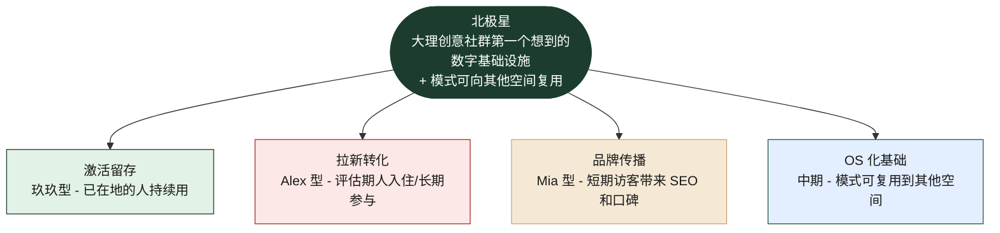

# cyc.center 机会树

> ⚠️ **2026-05-02 v2 更新**：本文档里 **profile 系统 v1** 原本被描述为独立 feature。
> 之后 [[homepage-design]] 决定 profile **嵌入在活动卡片头像里**（点击展开人物卡片），不再单独 v1。
> 简化版 profile（头像+名字+一句话）和首页改造**绑在一起做**，不能拆。详细见 [[homepage-design]] 和 [[PLAN-USING-SKILLS]] Phase 3.1。
> 树结构和 ICE 排序整体仍然有效，只是 profile 的"实现形态"变了。
>
> Phase 2.3 产出。基于 PRODUCT.md 战略 + Phase 2.0 路径 + Phase 2.1 personas + Phase 2.2 矩阵。
>
> 树结构：**Outcome → Sub-outcomes → Opportunities → Solutions → ICE 评分**。
>
> 用户语言（"我想…" / "我担心…"），不是功能语言。

---

## 北极星 Outcome

> **cyc.center 成为大理创意社群第一个想到的数字基础设施，并在 12 个月内验证模式可向其他空间复用。**

可量化：
- M1 月活跃成员数（区分本地 vs 远程）
- M2 通过 cyc 入口的新成员比例（vs 朋友推荐 / 微信群 / 偶遇）
- M3 第三方空间询问"用 cyc 模式" 的次数（OS 化信号）

---

## Sub-outcomes（按 persona / pathway 切）

---

## S1: 激活留存（玖玖型）

### Opportunity O1.1 — "我每周收到大量活动信息但不知道哪些值得去"

| Solution | I | C | E | Total | 备注 |
|---|---|---|---|---|---|
| 活动通告生成器（已建）| 8 | 9 | 10 | **27** | ✅ 不动，是入口忠诚度 |
| 个人化推荐（"上次你来了 X，本周类似的有 Y"）| 7 | 4 | 3 | 14 | 后置，需数据 |
| **关注/订阅特定发起人**（玖玖关心 Sara 在做什么）| 8 | 7 | 5 | **20** | 高 ROI，配合 profile |

### Opportunity O1.2 — "我想合作但找不到具体能力的人"

| Solution | I | C | E | Total | 备注 |
|---|---|---|---|---|---|
| **找搭子标签**（profile 上发"找内容合作"）| 9 | 7 | 6 | **22** | 直击玖玖核心 |
| 主动 matchmaking（cyc 撮合）| 6 | 3 | 2 | 11 | 太早做，先有 profile |
| 项目展示墙（成员的 active projects）| 7 | 6 | 5 | 18 | profile v2 配套 |

### Opportunity O1.3 — "我做的小生意/项目想被看见但缺渠道"

| Solution | I | C | E | Total | 备注 |
|---|---|---|---|---|---|
| **profile 上的 active project 卡片**（最多 3 条 + 链接）| 8 | 8 | 7 | **23** | 强信号 + 易实现 |
| 月度社区简报（本月谁在做什么）| 7 | 6 | 4 | 17 | 编辑工作量大 |
| 活动发起人 profile 自动 backlink 到现场 | 7 | 7 | 6 | 20 | 配合活动详情改造 |

---

## S2: 拉新转化（Alex 型）

### Opportunity O2.1 — "我来之前根本不知道大理是不是适合我"

| Solution | I | C | E | Total | 备注 |
|---|---|---|---|---|---|
| **Path A 首屏 v1**（一句定位 + 实景照 + 唯一 CTA）| 10 | 8 | 7 | **25** | demo unlock |
| **空间相册 + 故事注释**（不是产品图，是有人的瞬间）| 9 | 8 | 6 | **23** | Path A 核心 |
| 现有成员故事卡（3-6 条 quote + 真名）| 9 | 8 | 6 | **23** | identity-fit signal |
| 英文 hero tagline | 6 | 8 | 9 | 23 | Alex 信任信号 |

### Opportunity O2.2 — "我怕住进来不合适但 commit 太早"

| Solution | I | C | E | Total | 备注 |
|---|---|---|---|---|---|
| **试住一周机制**（Loss Aversion 反向用）| 9 | 6 | 4 | 19 | 需要运营对接 |
| 房型 / 价格透明页（DNA / Outsite 同款）| 9 | 8 | 6 | **23** | Path B 0→1 |
| 成员评价 grid（依赖 profile）| 8 | 7 | 5 | 20 | profile 上线后做 |
| FAQ + 决策卡（"如果我是 X 类型该怎么决定"）| 7 | 7 | 7 | 21 | 编辑成本中等 |

### Opportunity O2.3 — "我想在还没住进来时就先认识几个人"

| Solution | I | C | E | Total | 备注 |
|---|---|---|---|---|---|
| **profile 系统 v1**（横切，3 persona 都需要）| **10** | **9** | **6** | **25** | **最高 ROI 单点** |
| 远程订阅模式（Substack 化的 cyc 通讯）| 8 | 6 | 5 | 19 | 中期变现钩子 |
| 试住前 1:1 视频咨询入口 | 6 | 5 | 4 | 15 | 高门槛，少做 |

---

## S3: 品牌传播（Mia 型）

### Opportunity O3.1 — "我想找非游客活动但找不到"

| Solution | I | C | E | Total | 备注 |
|---|---|---|---|---|---|
| **/events SSR + OG meta**（已在 PLAN.md）| 9 | 9 | 7 | **25** | SEO 必需 |
| 活动详情页"对外开放"明确标签 | 8 | 9 | 9 | **26** | 一行字解锁 Mia |
| 活动类型 SEO 友好分类页 | 7 | 7 | 5 | 19 | 慢工 |

### Opportunity O3.2 — "我希望我的体验能朋友圈-able"

| Solution | I | C | E | Total | 备注 |
|---|---|---|---|---|---|
| **活动结束页（peak-end）+ 拍照墙**（参考 polaroid Artifact）| 9 | 8 | 6 | **23** | 留存 + 传播双 unlock |
| "标记 #cyc 你的照片可能上社区墙" 提示 | 8 | 8 | 9 | **25** | 一句话改造 |
| 活动现场快速生成"我去了 X 活动"分享卡 | 7 | 6 | 5 | 18 | 配合 OG image 生成 |

### Opportunity O3.3 — "我担心去到现场是不是被看作打扰本地人"

| Solution | I | C | E | Total | 备注 |
|---|---|---|---|---|---|
| **首屏明确"欢迎短期访客"信号** | 8 | 8 | 9 | **25** | 一行字 |
| 已报名头像 stack 显示"已经有 N 个新人来了"| 7 | 7 | 6 | 20 | 配合活动页改造 |
| 发起人欢迎信预设模板 | 6 | 5 | 6 | 17 | 运营动作 |

---

## S4: OS 化基础（中期 - 6-12 个月）

### Opportunity O4.1 — "其他空间运营者想用 cyc 这套"

| Solution | I | C | E | Total | 备注 |
|---|---|---|---|---|---|
| 文档化整套数据 schema + workflow（飞书 Bitable 模板）| 9 | 6 | 5 | 20 | OS 第一步 |
| **公开 case study：cyc 大理这套是怎么跑起来的** | 9 | 8 | 6 | **23** | 既是 marketing 也是招募 |
| 让 1 个朋友空间（在大理或别地）试用 cyc 模式 | 9 | 5 | 3 | 17 | 真正 PMF 信号 |
| API / 工具集开源 | 7 | 4 | 4 | 15 | 太早 |

### Opportunity O4.2 — "我（你自己）想确认这条路真的有意义"

| Solution | I | C | E | Total | 备注 |
|---|---|---|---|---|---|
| 持续运营 cyc 一年的真实数据 + retro | 10 | 9 | 7 | **26** | 必须做 |
| 投资人 demo 验证（market signal）| 9 | 7 | 6 | **22** | Phase 4 |
| 内化成"自己的 PM 方法论 skill"（utility-pm-skill-builder）| 8 | 8 | 8 | **24** | 副产品 |

---

## ICE 排序：Top 15 高 ROI Solutions

| 排 | 分 | Solution | Sub-outcome | Phase 落点 |
|---|---|---|---|---|
| 1 | **27** | 活动通告生成器（保持）| S1 | 不动 |
| 2 | **26** | 持续运营一年 + retro | S4 | 持续 |
| 3 | **26** | 活动详情页"对外开放"标签 | S3 | Phase 3.3 |
| 4 | **25** | **profile 系统 v1**（横切）| S2 | **Phase 3.4 提前** |
| 5 | **25** | Path A 首屏 v1 | S2 | Phase 3.1 |
| 6 | **25** | /events SSR + OG meta | S3 | Phase 3.3 |
| 7 | **25** | "标记 #cyc"提示一行字 | S3 | Phase 3.3 微改 |
| 8 | **25** | 首屏"欢迎短期访客"信号 | S3 | Phase 3.1 |
| 9 | **24** | 内化为 PM 方法论 skill | S4 | 副产品 |
| 10 | **23** | 空间相册 + 故事注释 | S2 | Phase 3.1 |
| 11 | **23** | 现有成员故事卡 | S2 | Phase 3.1（依赖 profile） |
| 12 | **23** | 房型 / 价格透明页 | S2 | Phase 3.2 |
| 13 | **23** | profile active project 卡片 | S1 | Phase 3.4 v2 |
| 14 | **23** | 活动结束页（peak-end）| S3 | Phase 3.3 |
| 15 | **23** | 公开 case study | S4 | Phase 4 周边 |

---

## 关键洞察（这棵树告诉我们的）

### 洞察 1：ICE 排出来的 Top 4 全部指向"两个杀手 feature"

- **Profile 系统 v1**（25 分） + 它解锁的依赖项（成员评价、发起人展示、active project 卡） = 占 Top 15 的 **1/3**
- **Path A 首屏 + /events SSR + 对外开放标签**（合计 4 项 25 分以上）= 一个完整的 **公共面 transformation**

→ **下个月只做这两件事，就能拉升 1/2 北极星**。

### 洞察 2：传播侧（S3）有"一行字 unlock"机会

| 一行字改造 | ICE | 工作量 |
|---|---|---|
| 活动详情页加"对外开放"标签 | 26 | 5 分钟 |
| 标记 #cyc 提示 | 25 | 5 分钟 |
| 首屏"欢迎短期访客"信号 | 25 | 30 分钟 |

→ **三件加起来 < 1 小时，传播侧巨大改善**。可以下午跑完。

### 洞察 3：S4（OS 化）现在不需要做产品工作

S4 的高 ICE solutions 都是**运营 + 内容动作**，不是 build：
- "持续运营一年 + retro" = 时间 + 反思
- "公开 case study" = 写一篇深度内容
- "内化为 PM skill" = 用 utility-pm-skill-builder 自动生成
- "让 1 个朋友空间试用" = 关系 + 谈话

→ **OS 化战略不需要现在做新代码**。它是 12 个月的副产品。

### 洞察 4：试住机制 ICE 不高（19）—— 不是不做，是先测

试住机制看似关键，但 ICE 只有 19，因为 confidence 和 ease 都不高（要运营对接，可能商业上不可持续）。**先用 hypothesis 验证再做** —— 不要 Phase 3 就 commit 它。

### 洞察 5：4 个 sub-outcome 不平衡，且应该如此

| Sub-outcome | Top 15 占比 |
|---|---|
| S1 激活留存（玖玖）| 2/15（已经做得不错）|
| S2 拉新转化（Alex）| 5/15 ⭐ |
| S3 品牌传播（Mia）| 5/15 ⭐ |
| S4 OS 化基础 | 3/15（运营内容为主）|

**S1 不需要再投入大量产品工作**（已强）。**S2 + S3 是接下来 6 个月的主战场**。

---

## 给 Phase 3 的修订建议

> 之前 PLAN v2 已经把 Phase 3 重排成 P0/P1/P2 优先级。这棵树进一步**确认并锁定**：

### Phase 3 第 1 周（unlock 一切的杠杆）

1. **profile 系统 v1**（25 分，横切武器，3 persona 同时受益）—— **必做**
2. **Path A 首屏 v1**（25 分，demo unlock）
3. **三件一行字改造**（合计 76 分，1 小时工作量）：
   - 对外开放标签
   - 标记 #cyc 提示
   - 欢迎短期访客信号

### Phase 3 第 2 周

4. **/events SSR + OG meta**（25 分，已在 PLAN.md）
5. **空间相册 + 成员故事卡**（23+23 分，依赖 profile）
6. **活动结束页（peak-end）**（23 分，留存 unlock）

### Phase 3 第 3 周

7. **房型 / 价格透明页**（23 分，Path B 0→1）
8. **active project 卡片**（23 分，profile v2）

### Phase 3 不做（先用 hypothesis 验证）

- 试住机制（19 分，confidence 低）
- 个人化推荐（14 分，需要数据积累）
- API 开源 / SaaS 化（15 分，太早）

---

## 给 Phase 2.5 的 hypothesis 候选

这棵树排名 Top 4 的 solution 隐含的假设：

**H1（最强候选）**：profile 系统 v1 上线后，3 persona 的关键转化指标（玖玖的留存 / Alex 的入住决策时间 / Mia 的 RSVP 率）都会上升 —— **如果只有一个 hypothesis 要测，是它**。

**H2**：Path A 首屏 + 空间相册 + 成员故事卡上线后，新访客留存率（首次访问 7 天内回访）从 X% 提升到 Y%。

**H3**：活动结束页（peak-end）上线后，参加过的人 30 天内重复参加率从 X% 提升到 Y%。

下一步用 define-hypothesis 把它们写成 testable 版本。
