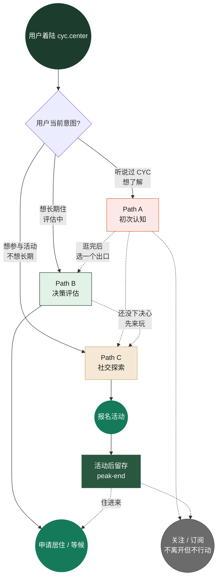
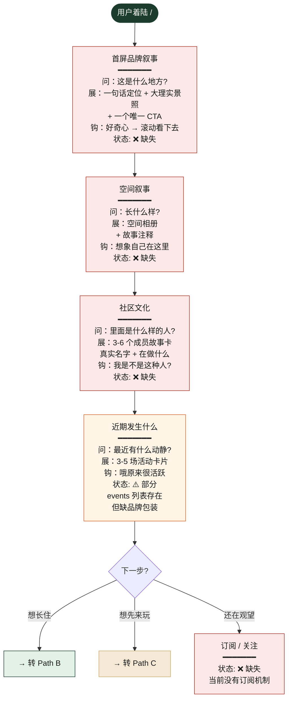
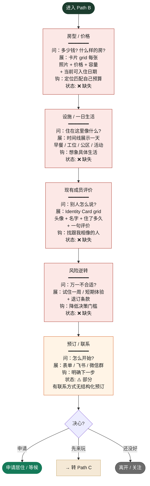
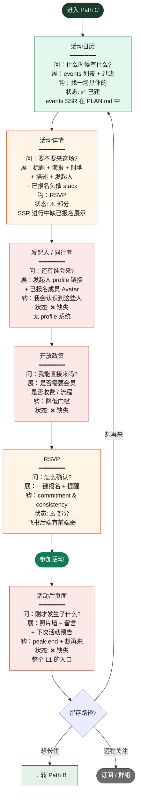

# cyc.center 转化路径分析 — Path A / B / C

> ⚠️ **2026-05-02 v2 更新**：本文档里关于 Path A 的具体页面结构（5-section 滚动 landing 等）已被 [[homepage-design]] 替换。
> 真实设计是：**Path A 入口 = 首页顶部 hero 双海报中的"介绍社区"那张** → 点击进入 `/about` 介绍页（含品牌叙事 + 成员故事 + 嵌入照片墙 section）。
> 路径分析的**整体逻辑（A/B/C 三类用户、心理学武器、现状差距表）依然有效**，只是落点 page 由 [[homepage-design]] 决定。
>
> Phase 2.0 产出。每个节点标注：用户此刻的问题 + cyc.center 应展示的信息 + 下一步钩子 + 当前实现状态。
>
> **图例**：✅ 已建 · ⚠️ 部分 · ❌ 缺失

---

## 路径概览（漏斗交错图）



---

## Path A — 初次认知 "CYC 是什么？"

**目标用户**：第一次听说 cyc.center 的人（朋友安利、社交媒体、SEO、合作方介绍）。
**当前支持力度**：0/5 ❌ —— 着陆首页是"活动通告生成器"，对陌生人完全不友好。
**目标力度**：4/5 —— 这是 Phase 3 第一优先。
**关键心理武器**：curiosity gap · storytelling · identity-fit signal



### Path A 的心理学武器（ux-psychology）

| 节点 | 原则 | 实现 |
|---|---|---|
| 首屏 | **Curiosity gap** | 一句话定位**不要把答案给完**。例："我们在大理建了一个工具站，但它其实在做别的事。" |
| 首屏 | **Identity-fit signal** | 第二屏立刻让目标用户认出"这是给我做的" —— 用一句他们的语言（"做独立项目的"/"远程工作的"/"在大理找同类的"）|
| 空间叙事 | **Storytelling** | 不要用"我们的空间设有 X"，用"上周二下午 4 点，Sara 在咖啡桌上画完了她的第一份 logo 提案" |
| 社区文化 | **Specificity** | 真名 + 真项目 + 真照片。任何"会员们"、"很多人"、stock photo 都立即破坏可信度 |

---

## Path B — 决策评估 "我要不要去住？"

**目标用户**：已经知道 CYC 是什么，正在评估要不要长期入住。
**当前支持力度**：0.5/5 ❌ —— 几乎完全空白，只有 PLAN-MEMBERS.md 提到将来会做。
**目标力度**：3.5/5 —— Phase 3 第二优先。
**关键心理武器**：social proof · risk reversal · concrete specifics



### Path B 的心理学武器

| 节点 | 原则 | 实现 |
|---|---|---|
| 房型 / 价格 | **Concrete specifics** | 不要"价格灵活"，写"6/15 起入住，单间 2400/月，含早" |
| 一日生活 | **Mental simulation** | 时间线让用户脑内"放电影"试住一天 |
| 成员评价 | **Social proof** | 用真实成员的 Identity Card，附上"住了 X 个月"作为信任标记 |
| 风险逆转 | **Loss aversion 反向用** | "试住一周不合适全额退" → 把"承诺"变成"先体验" |
| 联系入口 | **Concrete next step** | 不要"了解更多"，写"加 Sara 微信问一下"（具体的人比抽象的"我们"可信） |

---

## Path C — 社交探索 "有什么好玩的？"

**目标用户**：知道 CYC 是什么，不想长住，但想参与活动 / 认识人。
**当前支持力度**：3/5 ⚠️ —— 你最强的一条。events 已建，约饭工具已建，但缺成员故事和留存设计。
**目标力度**：4.5/5 —— 优化为主，不重做。
**关键心理武器**：fresh action · low-stakes invitation · peak-end · endowed progress



### Path C 的心理学武器

| 节点 | 原则 | 实现 |
|---|---|---|
| 活动详情 | **Social proof（可视化）** | 已报名头像 stack 比"已 12 人报名"更有用 —— 看到有人 = 想加入 |
| 发起人展示 | **Halo effect** | 发起人 profile 卡（专长 + 过往活动）借光给当前活动 |
| 开放政策 | **Low-stakes invitation** | 写"任何人都欢迎，不用说理由" 比写"开放给社区成员"友好 10 倍 |
| RSVP | **Commitment & consistency** | 报名后立即触发"加日历"+ "邀请朋友"，让承诺再加固一次 |
| 活动后页面 | **Peak-end rule** | 这是整个 Path C 最被低估的一步 —— 决定"会不会再来" |
| 活动后页面 | **Endowed progress** | 显示"你参加了 3 场，再来 2 场就解锁 X" 类轻量游戏化（不是 KPI） |

---

## 现状 vs 目标差距表

| 路径 | 阶段 | 当前 | 目标 | 优先 | Phase 3 段落 |
|---|---|---|---|---|---|
| **Path A** | 首屏品牌 | 0 | 5 | 🔴🔴🔴 | 3.1 |
| Path A | 空间叙事 | 0 | 4 | 🔴🔴 | 3.1 |
| Path A | 社区文化 | 0 | 4 | 🔴🔴 | 3.1 |
| Path A | 加入入口 | 1 | 4 | 🔴 | 3.1 |
| **Path B** | 房型 / 价格 | 0 | 4 | 🔴🔴 | 3.2 |
| Path B | 一日生活 | 0 | 3 | 🟡 | 3.2 |
| Path B | 成员评价 | 0 | 4 | 🔴 | 3.2（依赖 3.4 profile）|
| Path B | 风险逆转 | 0 | 3 | 🟡 | 3.2 |
| Path B | 预订入口 | 1 | 3 | 🟡 | 3.2 |
| **Path C** | 活动日历 | 4 | 4 | ✅ | 不动 |
| Path C | 活动详情 | 3 | 5 | 🔴 | 3.3 |
| Path C | 发起人展示 | 0 | 4 | 🔴 | 3.3（依赖 3.4 profile）|
| Path C | 开放政策 | 0 | 3 | 🟡 | 3.3 |
| Path C | RSVP | 2 | 4 | 🔴 | 3.3 |
| Path C | **活动后 peak-end** | 0 | 5 | 🔴🔴 | 3.3（关键留存 unlock）|

---

## 关键洞察 + 接下来该做什么

### 洞察 1：Path C 的「活动后页面」是最被低估的杠杆
你已经擅长把人吸引来参加活动，但**活动后那一刻**几乎完全空白。这一步决定他下次来不来、要不要长住、要不要推荐给朋友。**ROI 最高的单点改进**就是它。

### 洞察 2：成员 profile 是横切武器
- Path B 需要成员评价 → 用 profile 卡
- Path C 需要发起人介绍 + 已报名展示 → 用 profile 卡
- L3 客厅的核心也是 profile

→ **Phase 3.4 profile 应该提到 Phase 3.2/3.3 之前做**，不要按编号顺序

### 洞察 3：Path A 是投资人 demo 的关键
4 月那场（或下一场）投资人会议，他点开 cyc.center 看到的第一眼就是 Path A 起点。如果还是"活动通告生成器"那个工具站界面，所有 OS 叙事都接不上。

→ **Phase 3.1 是投资人 demo 的硬性前置**，不能延后

### 修订后的 Phase 3 真实优先级

```
🔴 P0（投资人 demo unlock + 高 ROI 留存）
   3.1 Path A 首屏到加入入口（一周内做出 v1）
   3.4 成员 profile 系统（依赖项，所有其他都需要）
   3.3 活动后 peak-end 页面（最被低估的留存杠杆）

🟡 P1（构建中放
   3.2 Path B 房型 / 评价 / 试住
   3.5 感谢系统机制设计（先文档化，后实现）

🟢 P2（文档跟上即可）
   3.6 照片墙（可以用现成 grid，不用造轮子）
   3.7 release notes 流程
```

---

## 一句话回到 PLAN

**重新排序后**：Phase 2 做完 → Phase 3 第一周做 3.1 + 3.4 + 3.3，第二周做 3.2，第三周做 3.5/3.6 → Phase 4 投资人 demo 时整条 Path A 已经能讲故事。
